# 🏥 ZEECARE

ZEECARE is a full-stack web application providing **comprehensive medical treatment services**.  
It is dedicated to delivering high-quality healthcare solutions that meet the diverse needs of patients, with features like **appointment booking, patient records, and doctor dashboards**, ensuring a seamless digital healthcare experience.

---

## Features

- **User Authentication** – Secure JWT-based authentication with password hashing.  
- **Appointment Booking** – Patients can easily schedule, manage, and cancel appointments with doctors.  
- **Medical Records Management** – Digital storage and retrieval of patient records.  
- **Doctor Dashboard** – Manage appointments, view patient details, and update medical history.  
- **Responsive UI** – Accessible across desktop and mobile devices for ease of use.   

---

## Tech Stack

- **Frontend**: HTML, CSS, JavaScript, React.js 
- **Backend**: Node.js, Express.js  
- **Database**: MongoDB  
- **Authentication**: JWT with bcrypt    

---

## Installation

1. Clone or extract the repository.
2. Navigate to the `src` and `public` directories and run `npm install` in each to install dependencies. Ensure you have Node.js installed.
3. Create a `.env` file based on `.env.example` and set:
   ```env
   JWT_SECRET= <your secret key>
   ```
    
4. Start the backend server:

   ```bash
   npm run start
   ```
   The backend will run at `http://localhost:4000`.
   

6. Start the frontend in development mode:

   ```bash
   npm run dev
   ```

   The frontend will run at `http://localhost:5174`.

7. Start the Dashboard in development mode:

   ```bash
   npm run dev
   ```

   The Dashboard will run at `http://localhost:5174`.

### Production build

To generate an optimized production build of the frontend, run:

```bash
npm run build
npm start
```

This builds the app for production and starts a server that serves the prebuilt pages.

## Usage

- Home Page: Visit the landing page and sign up or log in.
- Book Appointments: Patients can book appointments with doctors.
- View Records: Doctors can view and update patient records.
- Manage Dashboard: Doctors and admins manage appointments and users.
- Secure Access: Only authorized users can view or modify records.

## Screenshots
| Operation                     | Screenshot                                |
|------------------------------|--------------------------------------------|
| ✅ SignUp            | 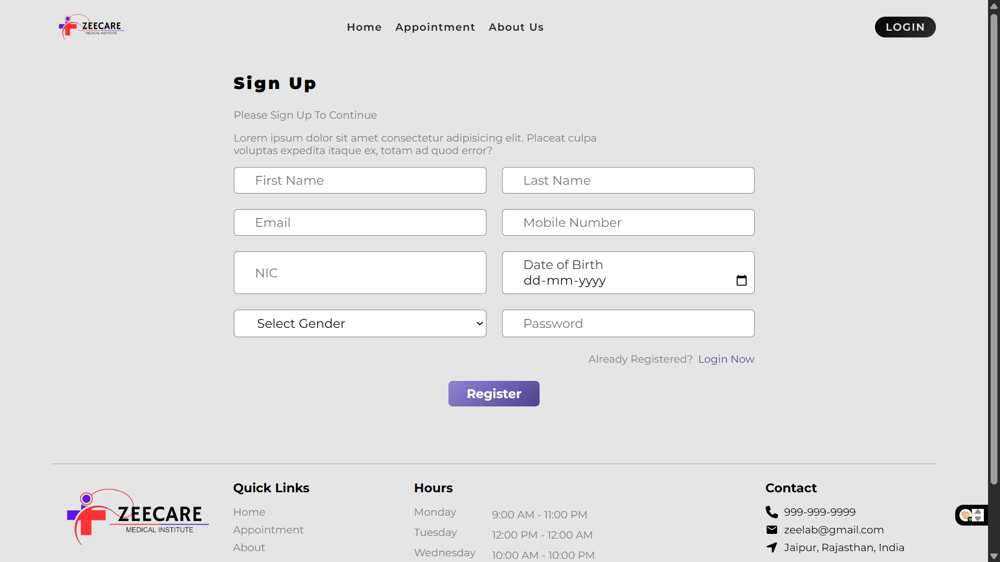 |
| ✅ SignIn            | 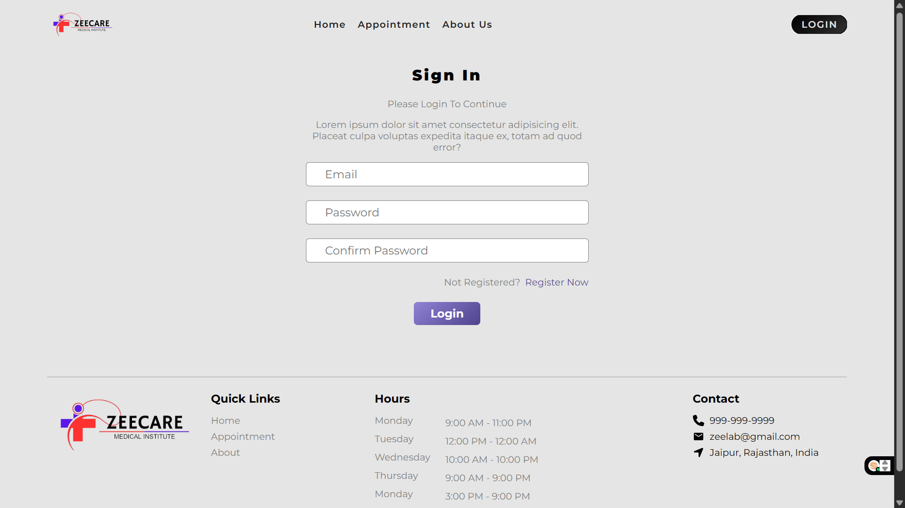 |
| ✅ Home             | 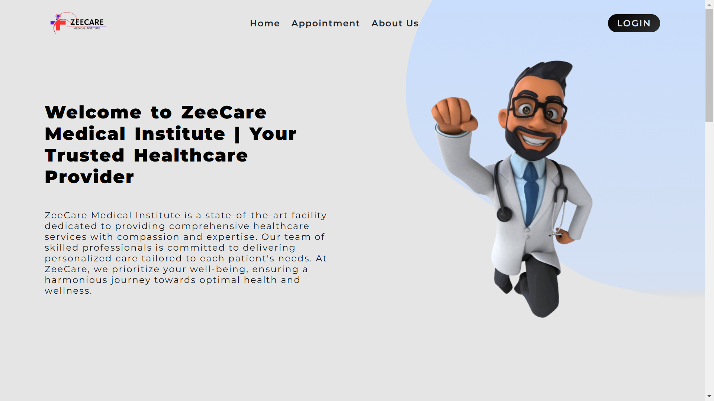 |
| ✅ Home             | 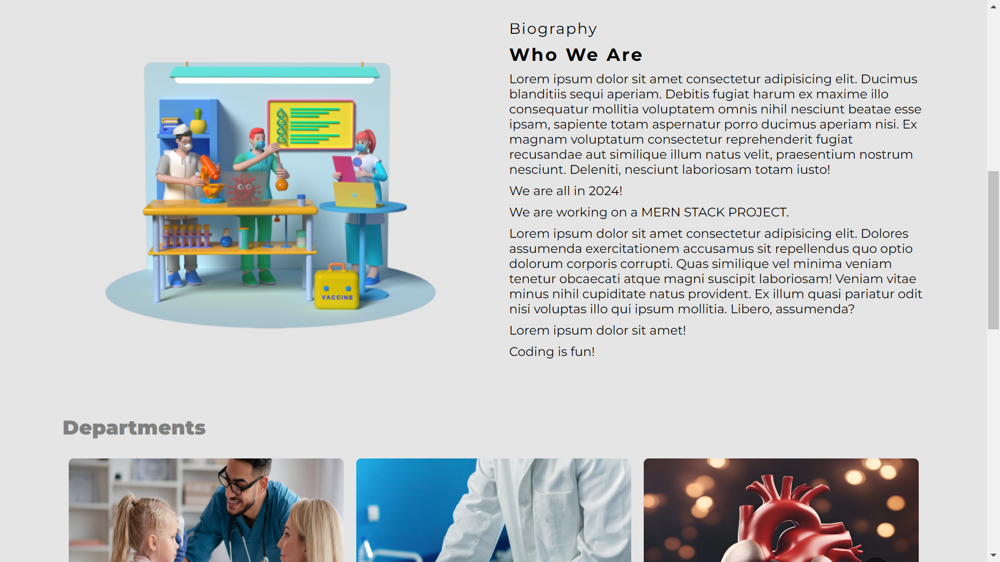 |
| ✅ Home             | 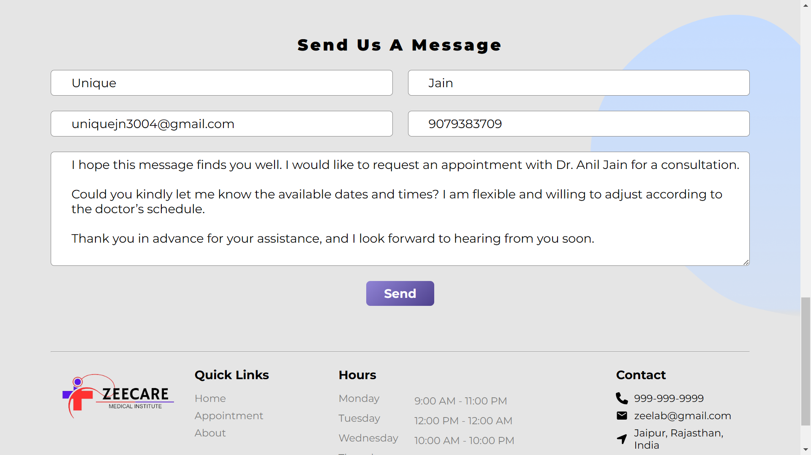 |
| ✅ Appointment      | 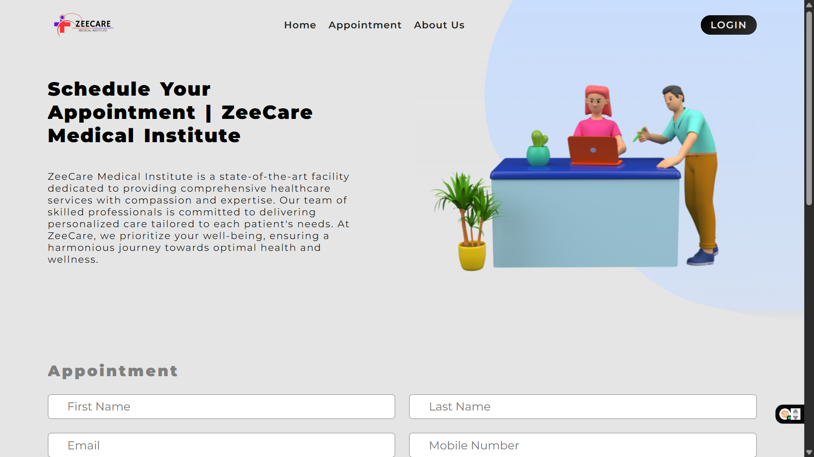 |
| ✅ Appointment      | 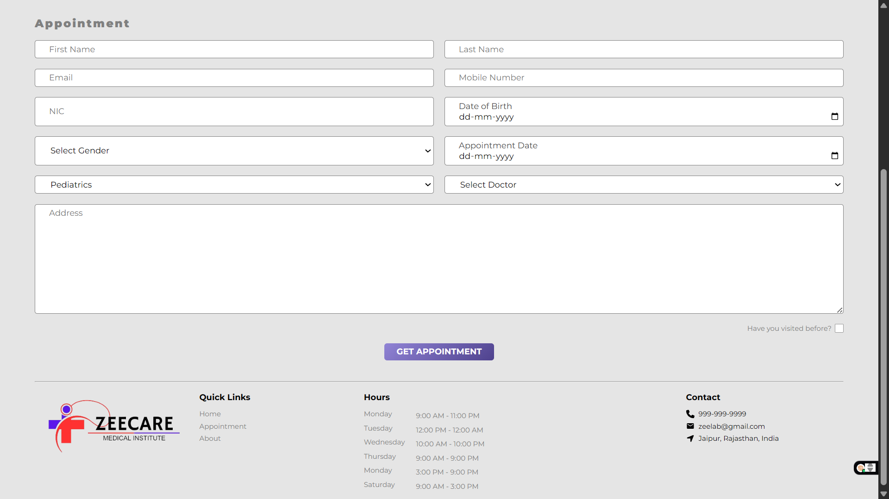 |
| ✅ About            | 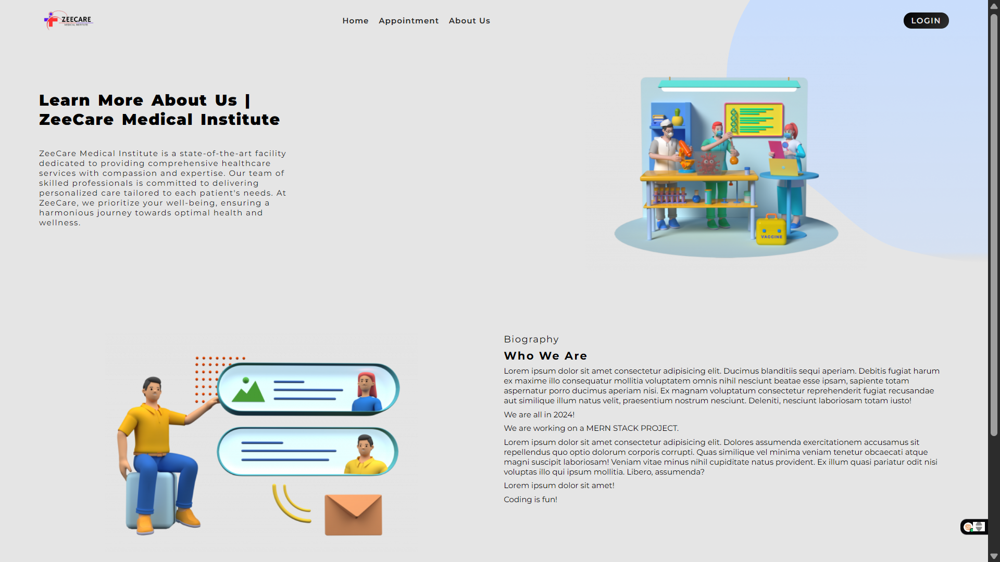 |
| ✅ Dashboard          | 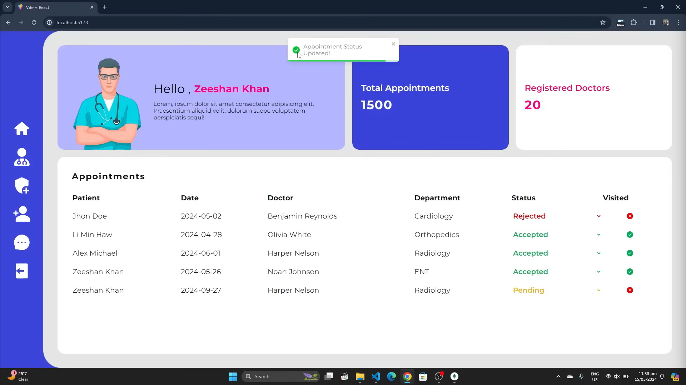 |
| ✅ Accept Appointment      | 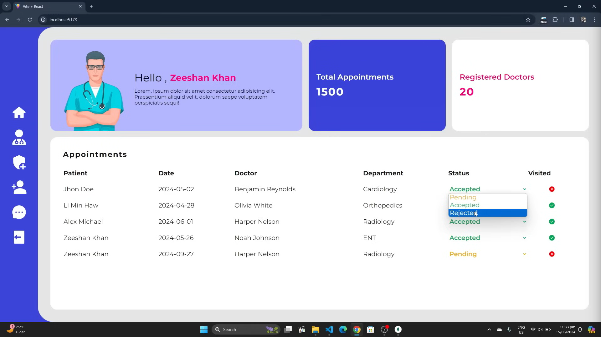 |
| ✅ Add Doctor      | 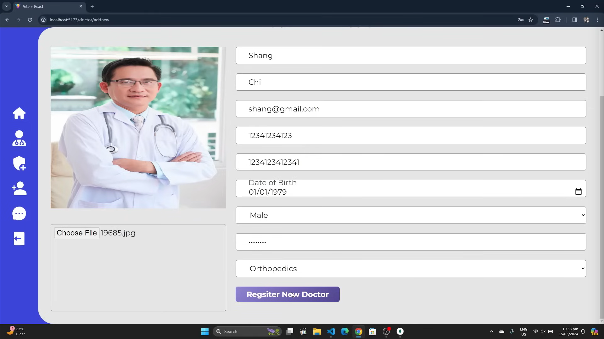 |
| ✅ Add Admin      | 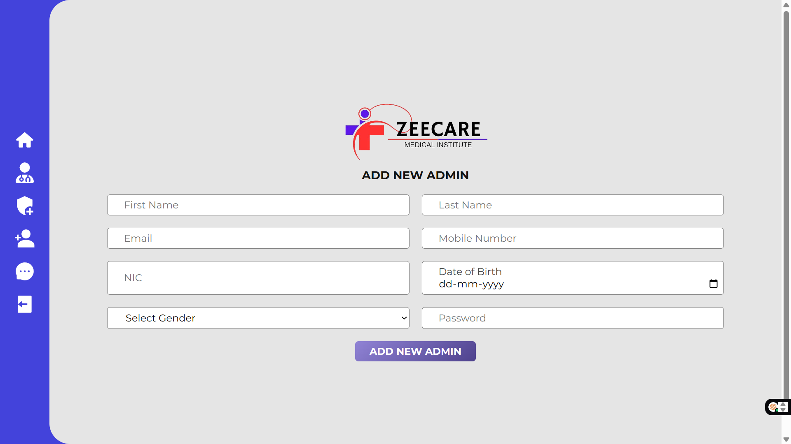 |
| ✅ Database         | 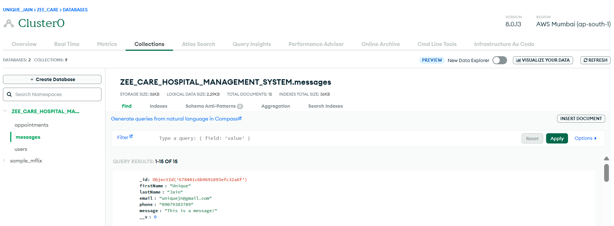 |
| ✅ User DB             | 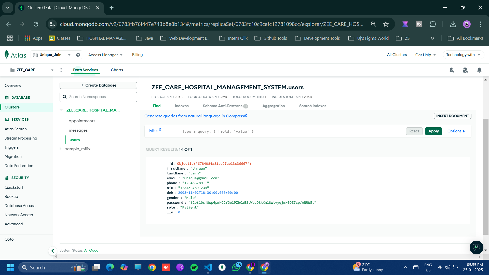 |

## Watch Demo Video  
- https://drive.google.com/file/d/1YYkTRazs9ef1yUcw4ZA_lHNQzF_1vbk5/view?usp=drive_link

## Contributing

Contributions are welcome! Fork the repository and open a pull request with your improvements.

## License

This project is licensed under the MIT License.
